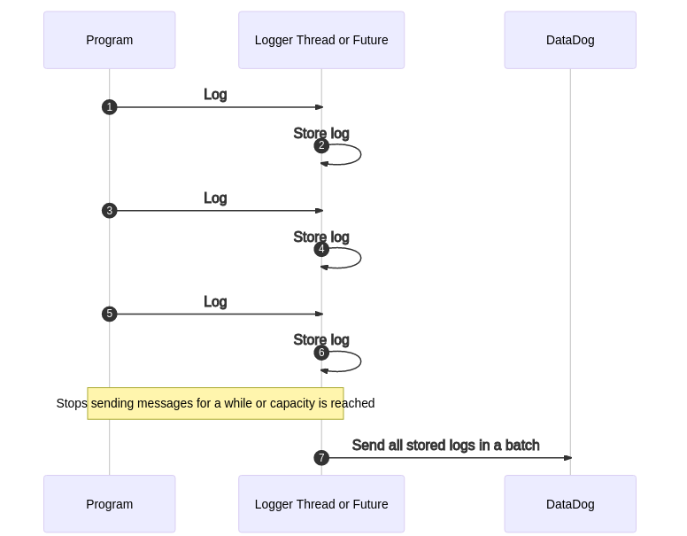

# Datadog Logs

## What
`datadog-logs` is a minimalistic crate for logging to DataDog. It does it directly via HTTP(S) using DataDog's public API.

## How
Logger consists of two parts - logging facade that sends messages to dedicated thread or task that batches messages to send to DataDog as presented on sequence diagram below.

Thanks to such a workflow logging should not affect throughput of your application, nor force you to handle errors arising from HTTP. 

## Why

Author found no existing library that could be used for this purpose.

## Feature flags

* `log-integration` - enables integration with `log` crate (enabled by default)