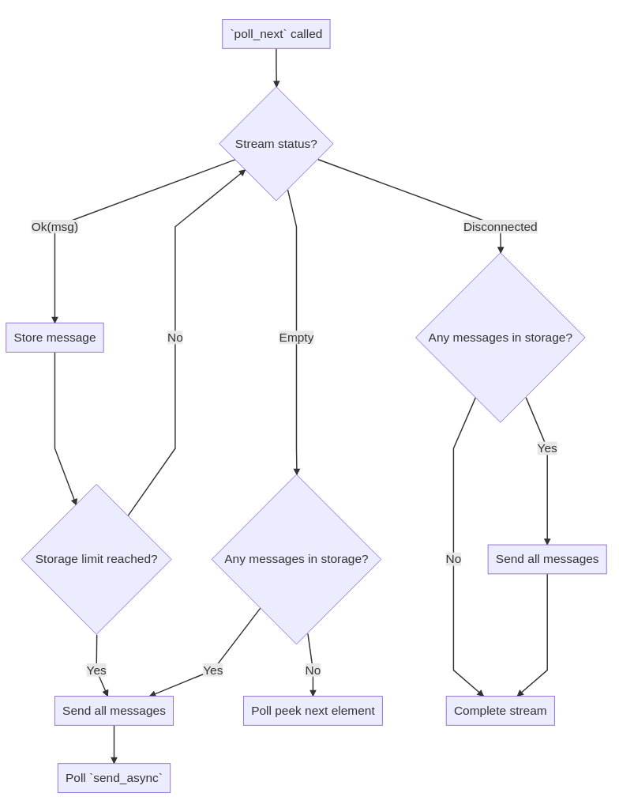

# Logger future ADR

This is document describing how logger future is intended to work. Meant to clarify it to future readers, much like **Archtectural Decision Record**.

## What happens int the `poll` ... stays in the `poll`

There are three events that can wake future up :
* first poll
* completion of `send_async`
* new message in log stream (new log or termination)

Diagram below shows desired algorithm to be executed with each call to `poll` done by executor. Keep in mind that you are only allowed to use `poll` or `poll_next` methods only when registering waker. Use non-async and non-blocking methods otherwise, like `try_recv` that return immediately without registering waker.

